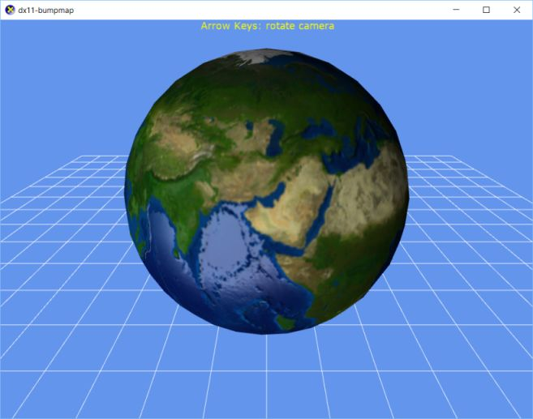

# dx11-bumpmap
</img>

Simple DirectX 11 project using DirectXTK to play with Normal Mapping and Gloss Mapping.
Replaces the DirectXTK standard effect types with a version that allows for writing custom vertex and pixel shaders to play around with.

After cloning ensure the submodules are available with `git submodule update --init`

(Tested build using VS 2017 Community Edition on Windows 10 using toolset v141 and Windows SDK 10.0.14393.0)
